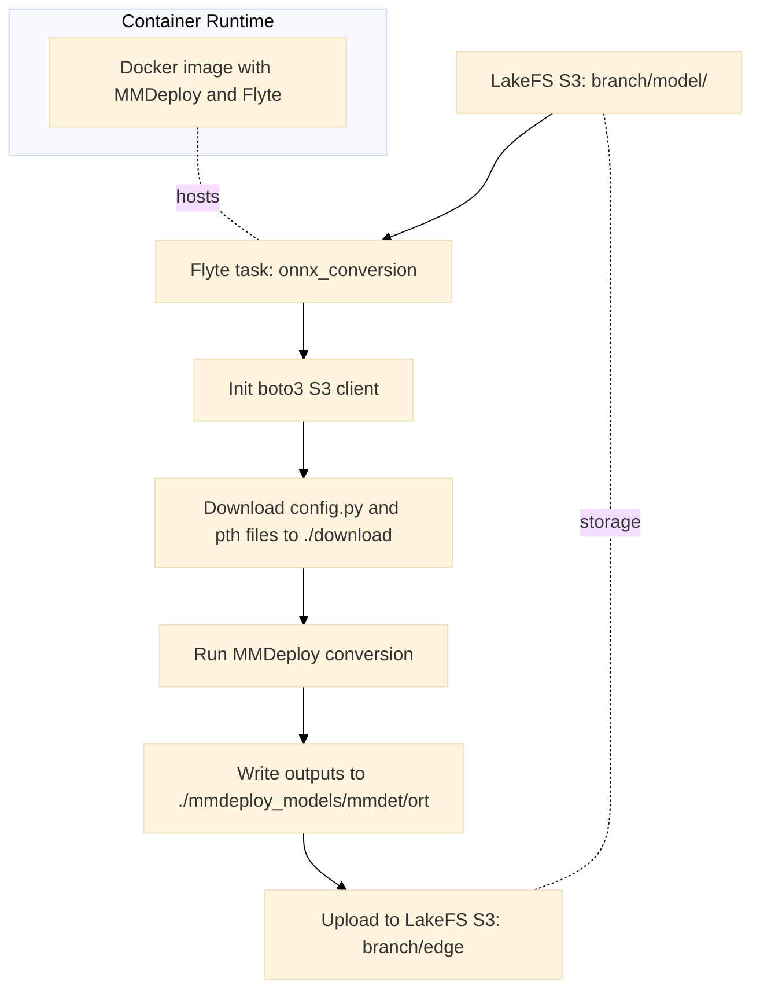
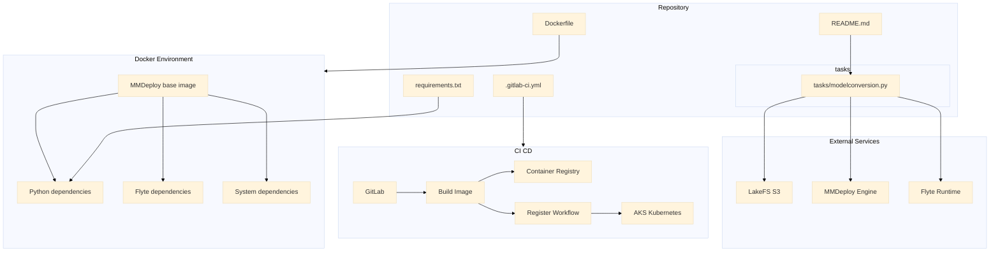

## ONNX Model Conversion — Diagrams (White Background)

### 1) Workflow

```mermaid
%%{init: {"theme": "base", "themeVariables": {"background": "white"}} }%%
flowchart TD
  A[LakeFS S3: branch/model/] --> B[Flyte task: onnx_conversion]
  B --> C[Init boto3 S3 client]
  C --> D[Download config.py and pth files to ./download]
  D --> E[Run MMDeploy conversion]
  E --> F[Write outputs to ./mmdeploy_models/mmdet/ort]
  F --> G[Upload to LakeFS S3: branch/edge]

  subgraph Runtime [Container Runtime]
    IMG[Docker image with MMDeploy and Flyte]
  end

  IMG -. hosts .- B
  A -. storage .- G
```

### 2) Architecture

```mermaid
%%{init: {"theme": "base", "themeVariables": {"background": "white"}} }%%
graph TB
  subgraph Repo [Repository]
    README[README.md]
    DOCKERFILE[Dockerfile]
    REQS[requirements.txt]
    CI[.gitlab-ci.yml]
    subgraph Tasks [tasks]
      TASK[tasks/modelconversion.py]
    end
  end

  subgraph DockerEnv [Docker Environment]
    BASE[MMDeploy base image]
    PYDEPS[Python dependencies]
    FLYTEDEPS[Flyte dependencies]
    SYSDEPS[System dependencies]
  end

  subgraph CICD [CI CD]
    GITLAB[GitLab]
    BUILD[Build Image]
    REGISTER[Register Workflow]
    REGISTRY[Container Registry]
    AKS[AKS Kubernetes]
  end

  subgraph External [External Services]
    LAKEFS[LakeFS S3]
    MMDEPLOY[MMDeploy Engine]
    FLYTE[Flyte Runtime]
  end

  README --> TASK
  DOCKERFILE --> DockerEnv
  REQS --> PYDEPS
  CI --> CICD

  BASE --> PYDEPS
  BASE --> FLYTEDEPS
  BASE --> SYSDEPS

  GITLAB --> BUILD --> REGISTRY
  BUILD --> REGISTER --> AKS

  TASK --> FLYTE
  TASK --> MMDEPLOY
  TASK --> LAKEFS
```
