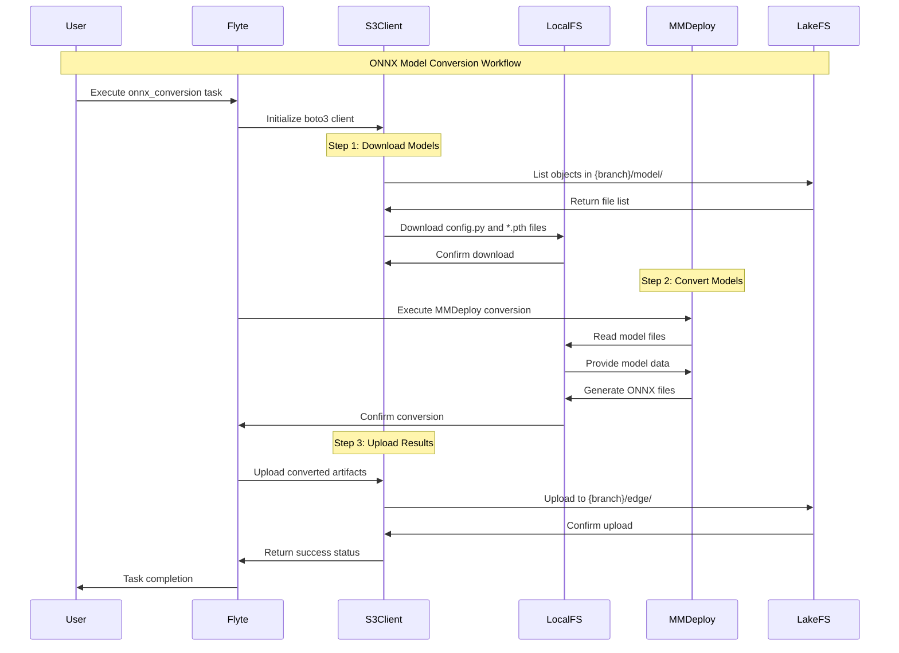
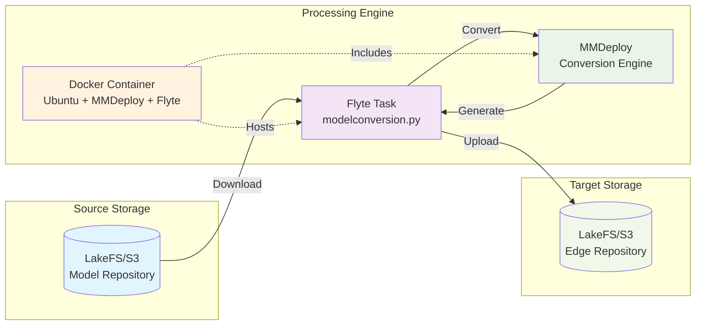

# ONNX Model Conversion Workflow Diagram

## Core Workflow Process

```mermaid
flowchart TD
    A[PyTorch Models in LakeFS/S3<br/>{branch}/model/] --> B[Flyte Task Execution<br/>tasks/modelconversion.py]
    B --> C[Download Models<br/>boto3 S3 client]
    C --> D[Local Storage<br/>./download/]
    D --> E[MMDeploy Conversion<br/>ONNX Export]
    E --> F[Output Generation<br/>./mmdeploy_models/mmdet/ort/]
    F --> G[Upload to LakeFS/S3<br/>{branch}/edge/]
    
    subgraph "Input Layer"
        A
    end
    
    subgraph "Processing Layer"
        B
        C
        D
        E
        F
    end
    
    subgraph "Output Layer"
        G
    end
    
    style A fill:#e1f5fe
    style B fill:#f3e5f5
    style C fill:#e8f5e8
    style D fill:#fff3e0
    style E fill:#fce4ec
    style F fill:#e0f2f1
    style G fill:#f1f8e9
```

## Detailed Process Flow



## System Architecture



## Key Components & Dependencies

### Core Files
- **`tasks/modelconversion.py`**: Main Flyte task implementation
- **`Dockerfile`**: Container environment setup
- **`requirements.txt`**: Python dependencies
- **`.gitlab-ci.yml`**: CI/CD pipeline configuration

### External Dependencies
- **MMDeploy**: Model conversion framework
- **Flyte**: Workflow orchestration
- **boto3**: S3/LakeFS client
- **LakeFS/S3**: Object storage

### Data Flow
1. **Input**: PyTorch models from `{branch}/model/` in LakeFS
2. **Processing**: Local conversion using MMDeploy
3. **Output**: ONNX models uploaded to `{branch}/edge/` in LakeFS

### Key Features
- **Automated**: Single Flyte task handles entire workflow
- **Scalable**: Containerized execution
- **Integrated**: Seamless LakeFS/S3 integration
- **CI/CD Ready**: GitLab CI/CD pipeline support
