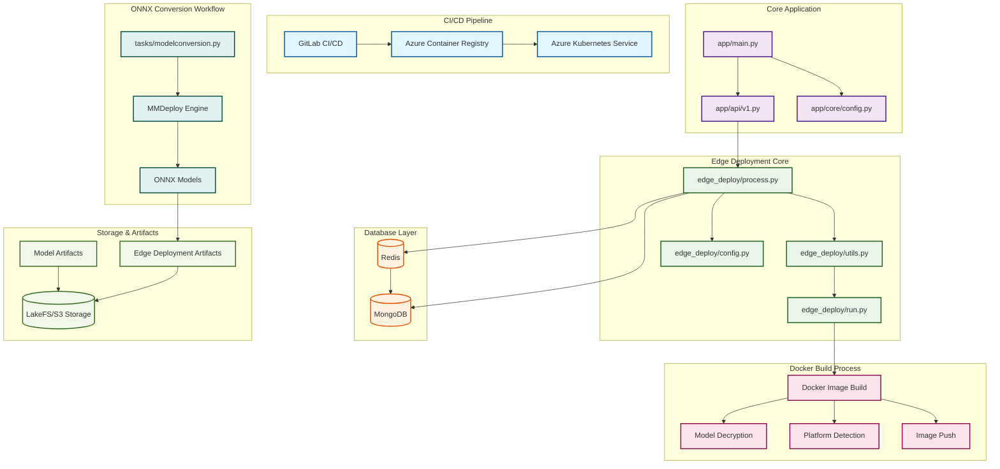

# ONNX Model Conversion Codebase Visual Map

## System Architecture Overview

## Detailed Component Breakdown

### 1. CI/CD Pipeline Layer
- **GitLab CI/CD**: Manages the build and deployment pipeline
- **Azure Container Registry (ACR)**: Stores Docker images
- **Azure Kubernetes Service (AKS)**: Orchestrates container deployments

### 2. Core Application Layer
- **`app/main.py`**: Main application entry point
- **`app/api/v1.py`**: API endpoint definitions
- **`app/core/config.py`**: Application configuration management

### 3. Edge Deployment Core Layer
- **`edge_deploy/process.py`**: Central processing logic for edge deployments
- **`edge_deploy/utils.py`**: Utility functions for deployment operations
- **`edge_deploy/config.py`**: Edge deployment specific configuration
- **`edge_deploy/run.py`**: Execution engine for deployment tasks

### 4. Database Layer
- **MongoDB**: Primary document database for storing deployment metadata
- **Redis**: In-memory cache and message broker for deployment operations

### 5. Docker Build Process Layer
- **Docker Image Build**: Main build orchestration
- **Model Decryption**: Handles encrypted model files
- **Platform Detection**: Identifies target deployment platforms
- **Image Push**: Pushes built images to registry

### 6. ONNX Conversion Workflow Layer
- **`tasks/modelconversion.py`**: Flyte task for model conversion
- **MMDeploy Engine**: Core conversion engine
- **ONNX Models**: Output converted models

### 7. Storage & Artifacts Layer
- **LakeFS/S3 Storage**: Object storage for models and artifacts
- **Model Artifacts**: Input PyTorch models and configurations
- **Edge Deployment Artifacts**: Output ONNX models and deployment files

## Data Flow

1. **Model Input**: PyTorch models are stored in LakeFS/S3 under `{branch}/model/`
2. **Conversion Process**: The Flyte task downloads models and converts them using MMDeploy
3. **Output Generation**: ONNX models are generated and stored locally
4. **Artifact Upload**: Converted models are uploaded to `{branch}/edge/` in LakeFS/S3
5. **Deployment**: Edge deployment core processes the artifacts for deployment

## Key Technologies

- **Flyte**: Workflow orchestration
- **MMDeploy**: Model deployment framework
- **Docker**: Containerization
- **LakeFS/S3**: Object storage
- **MongoDB**: Document database
- **Redis**: Caching and messaging
- **GitLab CI/CD**: Continuous integration/deployment

## Security Considerations

- Credentials are managed through environment variables
- No hardcoded secrets in the codebase
- Secure communication with storage services
- Container-based isolation for model processing
